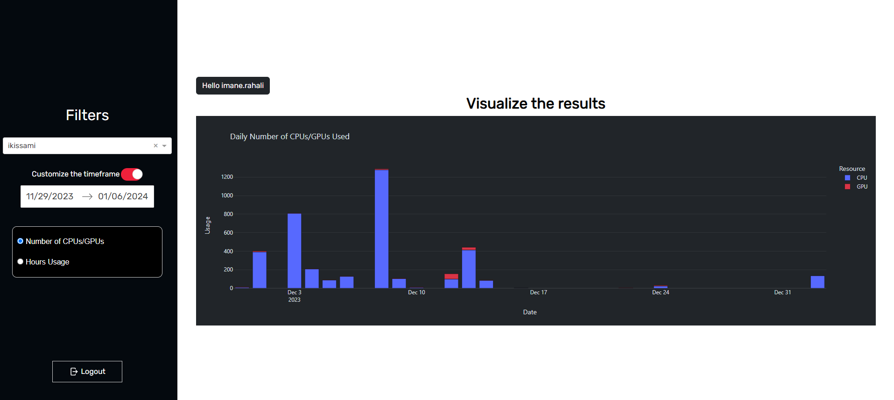

# CPU & GPU Usage Dashboard

## Introduction
This project is designed to provide an efficient way to monitor and display the usage of resources on the SimLab cluster. It allows users to connect via SSH and retrieve data about CPU/GPU usage.

## Features
- **Login Page:** Secure entry point requiring username and password.

- **SSH Connection:** Connects to SimLab using SSH for data retrieval.

- **User Dropdown Menu:** Displays all users of the cluster, allowing for specific user analysis.
- **Timeframe Filtering:** Offers predefined timeframes (e.g., 1 month ago, 2 months ago, ..., up to 1 year ago) or a custom timeframe.

- **Visualization Options:** Choose between two plots:
    - Number of CPUs/GPUs used
    - Number of hours of CPU/GPU usage

## How to Use
1. **Start the Application:** Launch the app and navigate to the login page.
2. **Login:** Enter your SimLab credentials and connect.
3. **Select User and Timeframe:** From the dropdown menu, select the user and specify the timeframe for the analysis.
4. **Choose and View Plot:** Select the desired plot type and view the graphical representation of resource usage.
4. **Logout** 